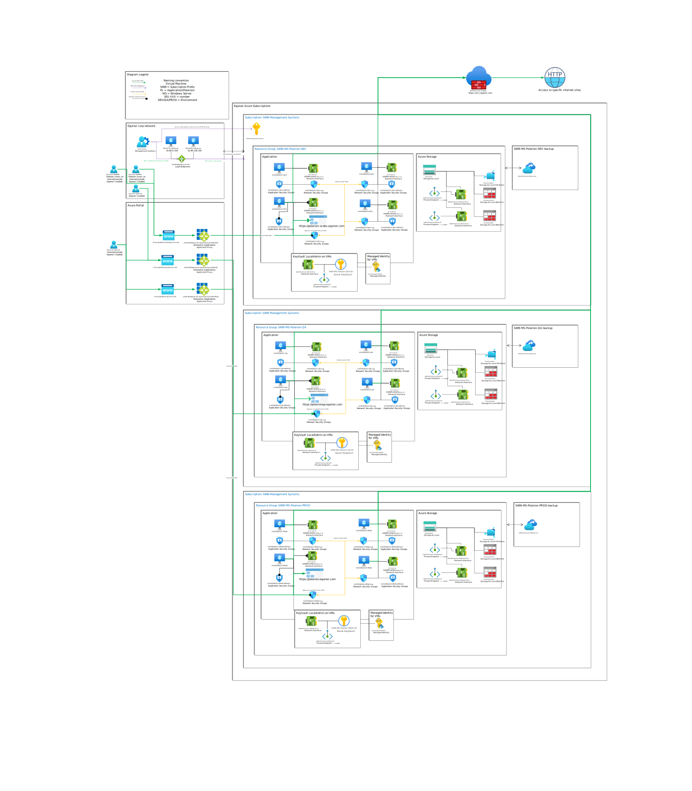

# Polarion Infrastructure as Code

[](https://developer.equinor.com/governance/scm-policy/)

Infrastructure repository for the MS Polarion 2025 Azure platform.

## What Is Deployed

The deployment is orchestrated by [Bicep/main.bicep](Bicep/main.bicep) and currently provisions:

- 1 main resource group: `S499-MS-POLARION-2025-<ENV>`
- 1 Recovery Services Vault resource group: `S499-MS-POLARION-2025-<ENV>-RSV`
- 1 Key Vault with private endpoint and RBAC role assignments
- 1 Log Analytics Workspace
- 1 Storage Account
- 1 Recovery Services Vault
- 4 Windows virtual machines

## Current Runtime Configuration

Based on [Bicep/modules/main-deployment.bicep](Bicep/modules/main-deployment.bicep):

- VM count: 4
- VM size: `Standard_D4s_v5`
- OS image: `MicrosoftWindowsServer/WindowsServer/2025-datacenter-g2/latest`
- OS disk: 512 GB, `Premium_LRS`
- VM name pattern: `<VM_NAME_BASE><NN>-<ENV>`
- Default VM name base: `S499PLWS25`
- Example DEV VM names:
  - `S499PLWS2501-DEV`
  - `S499PLWS2502-DEV`
  - `S499PLWS2503-DEV`
  - `S499PLWS2504-DEV`

## Environment Status

- Supported by template parameter validation: `DEV`, `TEST`, `QA`, `PROD`, `TST`, `PRD`, `DEMO` (plus lowercase variants)
- Present in repository today: `DEV` only ([Bicep/Environments/DEV/1.main.json](Bicep/Environments/DEV/1.main.json))
- Active GitHub Actions deployment job: `DEV` only ([.github/workflows/deploy-polarion.yml](.github/workflows/deploy-polarion.yml))

## Required Input Parameters

See [Bicep/main.bicep](Bicep/main.bicep). Key inputs include:

- `resourceGroupName`
- `rgLocation`
- `solution`
- `environment`
- `keyVaultName`
- `keyVaultAccessObject`
- `networkAccessPolicies`
- `subnetConfig` (`compute`, `privateEndpoints`, `recoveryServicesVault`)
- `storageAccountName`
- `skuName`
- `runner`
- `tags`

## Secret Requirements For VM Deployment

VM local admin passwords are read from Key Vault during deployment.

Secret name format is:

- `<lowercase-vm-name>-localadmin-password`

For DEV defaults, expected secret names are:

- `s499plws2501-dev-localadmin-password`
- `s499plws2502-dev-localadmin-password`
- `s499plws2503-dev-localadmin-password`
- `s499plws2504-dev-localadmin-password`

If these secrets are missing, VM deployment will fail.

## Deployment

The CI/CD workflow runs a subscription-level deployment with:

- Template: [Bicep/main.bicep](Bicep/main.bicep)
- Parameter file: [Bicep/Environments/DEV/1.main.json](Bicep/Environments/DEV/1.main.json)

Equivalent command pattern used in workflow ([.github/workflows/reusable-Management-Systems-Classic.yml](.github/workflows/reusable-Management-Systems-Classic.yml)):

```powershell
New-AzSubscriptionDeployment \
  -TemplateFile .\Bicep\main.bicep \
  -TemplateParameterFile .\Bicep\Environments\DEV\1.main.json \
  -resourceGroupName "MS-Polarion-2025" \
  -location "NorwayEast" \
  -rgLocation "NorwayEast" \
  -solution "MS-Polarion-2025" \
  -environment "DEV" \
  -runner "<public-runner-ip>"
```

## Network And Subnets

Subnet planning and examples are documented in [docs/subnet.md](docs/subnet.md).

The environment parameter file must provide subnet resource IDs through `subnetConfig`:

- `compute`
- `privateEndpoints`
- `recoveryServicesVault`

## Repository Structure

- [Bicep/main.bicep](Bicep/main.bicep): Top-level orchestration
- [Bicep/modules/dependencies.bicep](Bicep/modules/dependencies.bicep): Shared dependencies (KV, LAW, Storage, RSV)
- [Bicep/modules/main-deployment.bicep](Bicep/modules/main-deployment.bicep): VM deployment
- [Bicep/Environments/DEV/1.main.json](Bicep/Environments/DEV/1.main.json): DEV parameters
- [docs/setup.md](docs/setup.md): Initial setup notes
- [Manual/GeneratePassword.ps1](Manual/GeneratePassword.ps1): Local password generation helper
- [Manual/CreateSubnets.ps1](Manual/CreateSubnets.ps1): Subnet plan helper

## Diagram



## Security

Please report vulnerabilities as described in [Security.md](Security.md).
